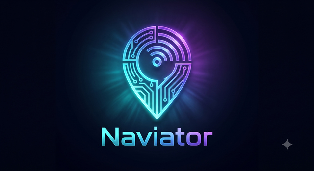
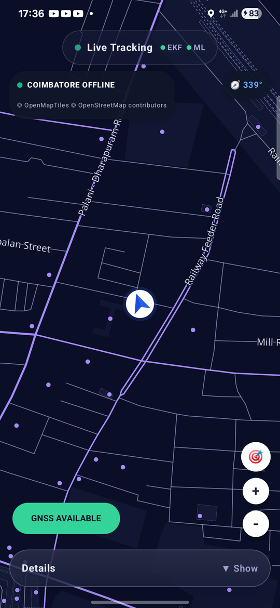
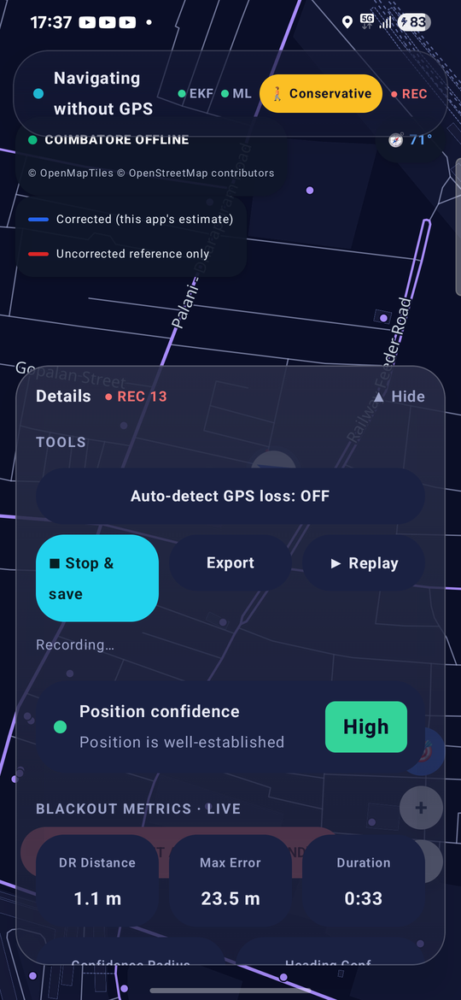
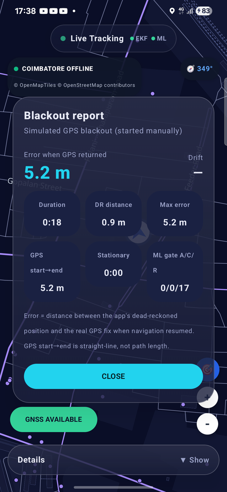
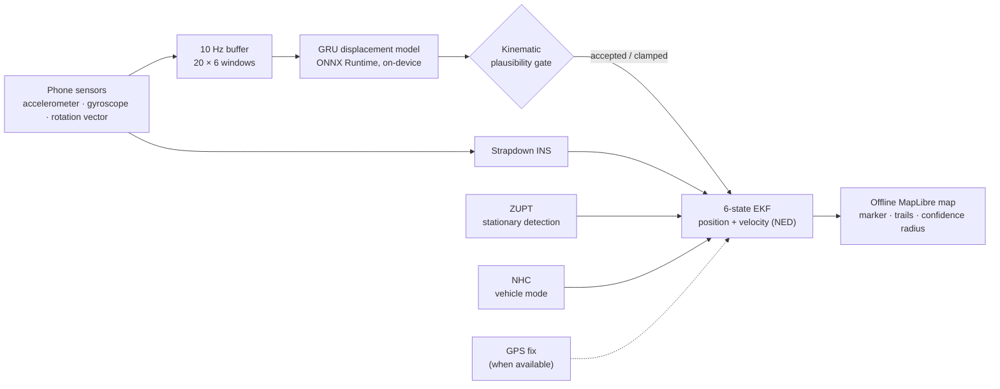
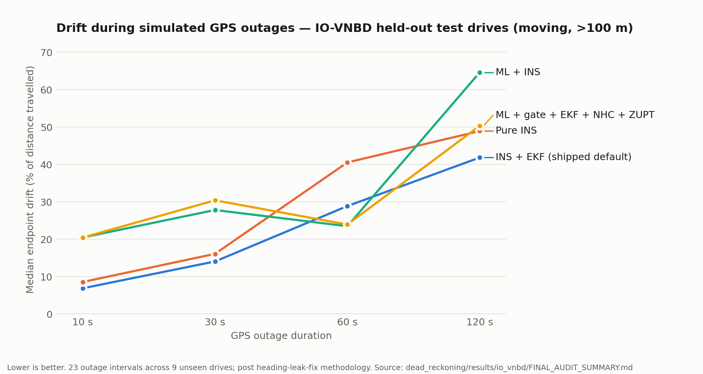

<p align="center">
  
</p>

<h3 align="center">Keeps your position moving when GPS disappears.</h3>

<p align="center">
  An offline Android navigation app that bridges GNSS blackouts (tunnels, basements, dense urban canyons) using only the phone's own inertial sensors: a physics-based dead-reckoning engine with an on-device GRU model as a gated assistant.
</p>

<p align="center">
  
  
  
  
  
  
</p>

---

## Why

GPS (and India's NavIC) needs line of sight to the sky. In tunnels, underground parking and between tall buildings the fix freezes or vanishes, which is exactly when ambulances, delivery riders and fleet trackers lose continuity. Automotive dead-reckoning modules solve this with dedicated sensors and CAN-bus wheel-speed data. This project attacks the harder version: do it with **nothing but a smartphone**, fully offline.

## Highlights

- **Runs entirely on the phone.** Sensor fusion, ML inference and map rendering are all local — no server, no network call. Inference takes **0.18 ms per window** on a desktop CPU; the model runs once per second.
- **Physics first, ML gated.** A strapdown INS + 6-state Extended Kalman Filter with zero-velocity updates (ZUPT) is the guaranteed estimator. A GRU predicts displacement from 2-second IMU windows and only contributes when a kinematic plausibility gate accepts its output.
- **Trained on real data, evaluated without leakage.** 29.7 hours of real driving (IO-VNBD, 72 synchronized drives, 5 drivers), split by whole drive into 53 / 10 / 9 train / validation / test. Normalization statistics come from the training split only.
- **Honest benchmark.** 288 simulated-outage evaluations (9 unseen drives × 10/30/60/120 s × 9 pipeline variants). A ground-truth heading leak in our own evaluation code was found, fixed, and every number regenerated — including retracting our previous headline result.
- **Exact PyTorch → ONNX parity.** Maximum output difference of **1.2 × 10⁻⁶ m** between the trained model and the deployed ONNX file; the deployed artifact is SHA-256 hash-locked.
- **Built for demos and field testing.** Automatic GPS-loss detection, live corrected-vs-uncorrected trails, a post-blackout error report scored against real GPS, session recording with CSV/GPX export, and replay.

## Screenshots

<table>
  <tr>
    <td align="center"></td>
    <td align="center"></td>
    <td align="center"></td>
  </tr>
  <tr>
    <td align="center"><b>Live tracking</b><br><sub>offline vector map, heading marker</sub></td>
    <td align="center"><b>GPS blackout</b><br><sub>dead reckoning, live metrics, recording</sub></td>
    <td align="center"><b>Blackout report</b><br><sub>error measured against real GPS</sub></td>
  </tr>
</table>

## How it works



1. **Sensors → frames.** Raw accelerometer and gyroscope readings are rotated from the phone's frame into the vehicle frame and then into North-East-Down using the fused rotation-vector heading.
2. **Physics.** The EKF propagates position and velocity, corrects them with GPS whenever a fix exists, and during a blackout keeps predicting — bounded by **ZUPT** (a "you're stationary" measurement) and, in vehicle mode, **non-holonomic constraints** (cars don't slide sideways). Its covariance becomes the confidence radius drawn on the map.
3. **ML.** A 2-layer GRU (64 hidden units) reads 2 s of IMU data and predicts local displacement `[dx, dy, dz]`. Predictions that imply an impossible speed change are clamped or rejected, and the physics estimate carries on.
4. **Map.** Coimbatore is bundled as offline vector tiles (OpenMapTiles schema) rendered with MapLibre, so the map keeps working with no connectivity.

## Results

<p align="center">
  
</p>

Median endpoint drift (% of distance travelled) on held-out IO-VNBD drives where the vehicle moved more than 100 m:

| Outage | INS + EKF *(shipped default)* | Pure INS | ML + INS | ML + gate + EKF + NHC + ZUPT |
|---:|---:|---:|---:|---:|
| 10 s  | **6.9 %**  | 8.6 %  | 20.5 % | 20.5 % |
| 30 s  | **14.1 %** | 16.1 % | 27.9 % | 30.4 % |
| 60 s  | 28.9 %     | 40.6 % | **23.5 %** | 24.0 % |
| 120 s | **41.9 %** | 49.0 % | 64.6 % | 50.4 % |

**What this shows.** The physics pipeline is the most reliable estimator on this dataset. The GRU is genuinely learned — it cuts per-window displacement error by 55 % versus a zero-motion baseline and beats a pedestrian-trained model on 8 of 9 unseen drives — but as a navigation aid it is inconsistent: it wins at 60 s and loses elsewhere. That is why the app ships physics as the default and treats ML as a gated assistant rather than hiding the result. Two scope notes: these are simulated outages on recorded drives (real GPS is withheld, never fabricated), and the benchmark uses the vehicle's reference heading frozen at outage entry, so it measures displacement estimation rather than consumer-gyro heading drift.

Full tables, per-drive results and the audit trail: [`dead_reckoning/results/io_vnbd/FINAL_AUDIT_SUMMARY.md`](dead_reckoning/results/io_vnbd/FINAL_AUDIT_SUMMARY.md).

## App features

| | |
|---|---|
| **Blackout mode** | Simulate a GPS outage with a two-tap control, or let **auto-detect** switch to dead reckoning when real GPS disappears while you're moving (and back after two good fixes). |
| **Live trails** | The corrected estimate and a deliberately uncorrected double-integration trail, side by side, with a growing confidence radius. |
| **Blackout report** | When GPS returns: error against the real fix, drift %, distance, max error and ML gate accept/clamp/reject counts. |
| **Record · export · replay** | Save a session, share it as CSV + GPX (opens in Google Earth or gpx.studio), and replay it on the map at 1–8×. |
| **Diagnostics** | EKF / ML / GNSS status, motion state, heading confidence with a compass-calibration prompt, sensor health. |
| **Offline map** | Free pan and zoom over bundled vector tiles; nothing is downloaded at runtime. |

## Repository layout

```
gudumap/                  Android app (Kotlin, Jetpack Compose) — the product
  app/src/main/java/.../
    navigation/           DeadReckoningEngine, EKF, ZUPT, NHC, NavigationEngine
    ml/                   ONNX Runtime model runner + input normalization
    sensors/              sensor registration, heading fusion, location
    map/ ui/ tracking/    offline map, Compose UI, session recording
  app/src/main/assets/    gru_io_vnbd.onnx, offline Coimbatore tiles, map style
dead_reckoning/           Python ML + evaluation pipeline
  src/preprocessing/      dataset loaders and window builders (OxIOD, IO-VNBD)
  src/training/           GRU training (pedestrian pre-training, vehicle fine-tuning)
  src/models/             model definition, ONNX export and parity checks
  src/navigation/         Python reference EKF / ZUPT / NHC
  src/evaluation/         outage simulator, 9-baseline benchmark, metrics
  models/                 checkpoints and the frozen, hash-locked ONNX model
  results/io_vnbd/        benchmark outputs and audit reports
docs/                     project status log, technical guide, branding
```

## Getting started

### Android app

1. Open `gudumap/` in a recent Android Studio (AGP 9.4, Kotlin 2.2). Min SDK 24, target SDK 37.
2. Run on a physical phone — the app needs a real accelerometer, gyroscope and GPS. Grant location permission on first launch.
3. Wait for a GPS fix, then tap **GNSS AVAILABLE → START GNSS BLACKOUT**, or enable **Details → Tools → Auto-detect GPS loss** and walk or drive somewhere GPS can't reach.

The trained model (`gru_io_vnbd.onnx`) and the Coimbatore offline map ship inside the app's assets; no downloads are needed.

### ML pipeline

```bash
cd dead_reckoning
python -m venv .venv && source .venv/bin/activate   # Windows: .venv\Scripts\activate
pip install -r requirements.txt

# datasets are not committed (several GB) — see "Data" below
python src/preprocessing/build_io_vnbd_dataset.py      # 10 Hz windows + drive-level split
python src/training/train_io_vnbd.py                   # fine-tune the vehicle GRU
python src/models/export_io_vnbd_onnx.py               # export + PyTorch/ONNX parity check
python src/evaluation/run_all_test_sequences_benchmark.py   # 288-run outage benchmark
```

## Data

| Dataset | Used for | Get it |
|---|---|---|
| **IO-VNBD** — Inertial and Odometry Vehicle Navigation Benchmark Dataset | vehicle model training and all benchmark results | [github.com/onyekpeu/IO-VNBD](https://github.com/onyekpeu/IO-VNBD) → `dead_reckoning/data/raw/IO-VNBD/` |
| **OxIOD** — Oxford Inertial Odometry Dataset | pedestrian pre-training | [deepio.cs.ox.ac.uk](http://deepio.cs.ox.ac.uk/) (request form) → `dead_reckoning/data/raw/` |

No sensor data in this project is synthetic. The only simulated element in evaluation is which window of real, recorded GPS is withheld to create an outage.

## Limitations

- The benchmark isolates displacement estimation using a reference heading; on a consumer phone, magnetometer and gyro heading errors add drift over long outages.
- The deployed model is trained for a phone fixed in a vehicle mount. A pedestrian model (OxIOD-trained) exists in `dead_reckoning/models/` but isn't wired into the app yet; walking uses a conservative physics-only fallback.
- The navigation filter is a deliberately simple 6-state EKF (no sensor-bias states).
- Offline map coverage is one demo region (Coimbatore).
- Everything above is measured on recorded datasets; road testing on more devices is ongoing.

## Authors

Built by **Hemesh** ([@hemesh283](https://github.com/hemesh283)) — navigation engine, Android app, offline maps and evaluation — with teammates who contributed parts of the ML pipeline and UI.

## License

Code is released under the [MIT License](LICENSE). Third-party data keeps its own terms: map data © OpenStreetMap contributors ([ODbL](https://opendatacommons.org/licenses/odbl/)), and the OxIOD / IO-VNBD datasets — including the processed training windows derived from them in `dead_reckoning/data/processed/` — are subject to their original licenses.

## Acknowledgements

- IO-VNBD: Onyekpe et al., *IO-VNBD: Inertial and Odometry benchmark dataset for ground vehicle positioning*, Data in Brief (2021).
- OxIOD: Chen et al., *OxIOD: The Dataset for Deep Inertial Odometry*, arXiv:1809.07491.
- Map data © [OpenStreetMap contributors](https://www.openstreetmap.org/copyright), tiles in the [OpenMapTiles](https://openmaptiles.org/) schema, rendered with [MapLibre Native](https://maplibre.org/).
